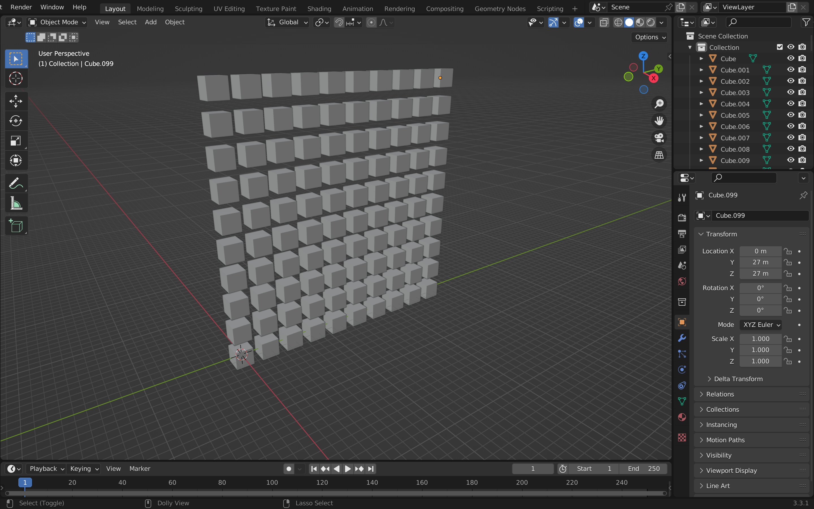

©pschreiber 2022

# bpyml - Project History

## Step 1 - simple API Tests:
- run simple Python script in Blender
- creating primitive cube with 
    ```
    bpy.ops.mesh.primitive_cube_add()
    ```
- loop for creating 10x10 cube matrix (takes 0.24s to build):
    ```
    size = 10

    for z in range(size):
        for y in range(size):
            bpy.ops.mesh.primitive_cube_add(location=(0, y * 3, z * 3))
    ```
    

- same loop for 50x50 cube matrix takes about 214.80s to build -> looking for faster way
- improved code:
```
    size = 50

    bpy.ops.mesh.primitive_cube_add()
    orig_cube = bpy.context.active_object

    for z in range(size):
        for y in range(size):
            m = orig_cube.data.copy()
            o = bpy.data.objects.new("cube", m)
            o.location = Vector((0, y * 3, z * 3))
            bpy.context.collection.objects.link(o)

    bpy.ops.object.delete()

```
-> takes about 2.66s to build
<br><br>
___

## Step 2 - write module for tf-model import
--> see [bpy_model.py](bpy_model.py)
<br><br>
___

## Related work
[Blender Neural Network from barckley75](https://github.com/barckley75/Blender_Neural_Network)
- uses the addon "Animation Nodes"
- configure layer parameters like shape, hidden layers, etc.. from scratch -> no model import
- it´s mostly control-panel based -> not very flexible